<!-- ████████████████████████████████████████████████████████████████████
     COMMIT YOUR assets/ FOLDER TO THE ROOT OF YOUR PROFILE REPO
     Repo structure:  IMApurbo/IMApurbo/
     ├── README.md
     └── assets/
         ├── banner.svg
         ├── terminal.svg
         └── skills.svg
     ████████████████████████████████████████████████████████████████████ -->

<!-- ══════════════════════════════════════════════════════════════
     ANIMATED WAVE HEADER  — fadeIn + text animation via capsule
     ══════════════════════════════════════════════════════════════ -->

 

<!-- ══════════════════════════════════════════
     ANIMATED BANNER  (CSS keyframes in SVG)
     ══════════════════════════════════════════ -->

 

<!-- Animated typing headline — hacker themed -->

  

---

##  &nbsp;`whoami`

<table>
  <tr>
    <td valign="top" width="55%">
      

        I operate at the intersection of <strong>offensive security</strong>, <strong>Python automation</strong>,
        and <strong>AI research</strong>. I don't just write code — I weaponize it (ethically 🛡️).
      

      <ul>
        <li>🔴 <strong>Ethical hacker</strong> — CVEs, bug bounties, responsible disclosure</li>
        <li>🐍 <strong>Python architect</strong> — automation tools, bots, scrapers, exploits</li>
        <li>🧠 <strong>AI / NLP engineer</strong> — chatbots, classifiers, NLP pipelines</li>
        <li>🌐 <strong>OSINT specialist</strong> — recon frameworks &amp; intelligence gathering</li>
        <li>📦 Published on <strong>PyPI</strong> — <code>fckr</code>, <code>crawlerx</code>, <code>nlpchat</code></li>
        <li>📫 <a href="mailto:imapurbo@proton.me"><strong>imapurbo@proton.me</strong></a> — PGP encrypted preferred</li>
        <li>⚡ <em>Fun fact</em>: I've read more RFCs than novels ☕</li>
      </ul>
       
      <!-- Animated status badges -->
      
      
      
    </td>
    <td valign="top" width="45%" align="center">
      <!-- Animated terminal SVG -->
      
    </td>
  </tr>
</table>

---

##  &nbsp;`cat /etc/skill_matrix.conf`

<table>
  <tr>
    <td valign="top" width="50%" align="center">
      <!-- Animated skill bar SVG -->
      
    </td>
    <td valign="top" width="50%">
       
      <h4>🔴 Offensive Security</h4>
      
      
      
      
      
        
      <h4>🐍 Languages &amp; Frameworks</h4>
      
      
      
      
      
        
      <h4>🧠 AI / ML Stack</h4>
      
      
      
      
        
      <h4>🛠️ Tools &amp; Infra</h4>
      
      
      
      
      
    </td>
  </tr>
</table>

---

##  &nbsp;`./fetch_stats.py --user IMApurbo`

&nbsp;

<!-- Streak stats — fire animation is CSS inside the served SVG -->

<!-- Activity graph — animated area fill -->

<!-- Trophies — fade-in animation -->

---

##  &nbsp;`ls -la ./projects/`

<table align="center">
  <thead>
    <tr>
      <th align="left">📦 Project</th>
      <th align="left">🎯 Category</th>
      <th align="left">📝 Description</th>
      <th align="left">⬇️ PyPI</th>
      <th align="left">📊 Downloads</th>
    </tr>
  </thead>
  <tbody>
    <tr>
      <td><strong><a href="https://github.com/IMApurbo/fckr">fckr</a></strong></td>
      <td></td>
      <td>High-performance multi-threaded brute-force tool for security research</td>
      <td></td>
      <td></td>
    </tr>
    <tr>
      <td><strong><a href="https://github.com/IMApurbo/crawlerx">crawlerx</a></strong></td>
      <td></td>
      <td>Async web crawling &amp; scraping framework for large-scale data extraction</td>
      <td></td>
      <td></td>
    </tr>
    <tr>
      <td><strong><a href="https://github.com/IMApurbo/nlpchat">nlpchat</a></strong></td>
      <td></td>
      <td>Easy-to-use AI chatbot builder with NLP pipelines &amp; intent detection</td>
      <td></td>
      <td></td>
    </tr>
  </tbody>
</table>

> [!CAUTION]
> These tools are for **authorized testing only**. Always obtain **explicit written permission** before testing any system you do not own. Unauthorized access is illegal. 🛡️

---

##  &nbsp;`./snake --eat-contributions`

<!-- Animated contribution snake (setup GitHub Action: Platane/snk) -->
<picture>
  <source media="(prefers-color-scheme: dark)" srcset="https://raw.githubusercontent.com/IMApurbo/IMApurbo/output/github-contribution-grid-snake-dark.svg"/>
  <source media="(prefers-color-scheme: light)" srcset="https://raw.githubusercontent.com/IMApurbo/IMApurbo/output/github-contribution-grid-snake.svg"/>
  
</picture>

> [!NOTE]
> **Snake setup** → Create `.github/workflows/snake.yml` using [Platane/snk](https://github.com/Platane/snk) to auto-generate the SVG on a schedule.

---

##  &nbsp;`curl api.quote/hacker`

---

##  &nbsp;`./establish_connection.sh`

&nbsp;
&nbsp;
&nbsp;
&nbsp;
&nbsp;

  

---

<!-- Animated wave footer — twinkling matches the header -->

  
    <kbd>root@imapurbo</kbd> · <kbd>Code with passion</kbd> · <kbd>Hack with ethics</kbd> · <kbd>Ship with caffeine ☕</kbd>
  

